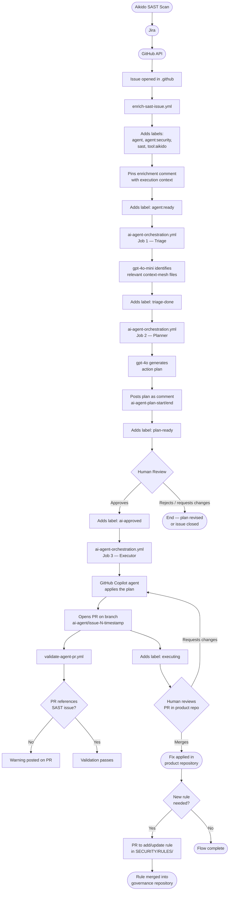

# .github — Organizational Governance Repository

This repository defines organizational governance for the `celfons` GitHub organization.
It contains no product code. Its purpose is to act as the control plane for AI-agent-driven
SAST vulnerability remediation.

---

## Purpose

- Defines how AI agents must behave when remediating security vulnerabilities
- Stores reusable remediation rules as the single source of truth
- Hosts GitHub Actions workflows that enrich, orchestrate, and validate security issues
- Maintains a living knowledge base of organizational patterns via the Context Mesh

This repository does **not** define product behavior. It defines **organizational rules**.

---

## How SAST Issues Are Created

SAST vulnerability issues are created automatically via the GitHub API:

```
Aikido (SAST scan) → Jira → GitHub API → Issue in this repository
```

- The issue body is **raw and immutable** — it is technical evidence from the scanner
- The body is **never modified** by any workflow, agent, or human
- The body is **not** a behavioral contract; it is forensic input

---

## Full Execution Flow

```
Issue opened (via API)
  → enrich-sast-issue.yml
      → adds labels: agent, agent:security, sast, tool:aikido
      → pins enrichment comment with execution context
      → adds label: agent:ready

  → ai-agent-orchestration.yml — Job 1: Triage
      → uses gpt-4o-mini (GitHub Models) to identify relevant context-mesh files
      → adds label: triage-done

  → ai-agent-orchestration.yml — Job 2: Planner
      → uses gpt-4o (GitHub Models) to generate an action plan
      → posts plan as a comment (delimited by <!-- ai-agent-plan-start/end --> markers)
      → adds label: plan-ready
      → awaits human approval (label: ai-approved)

  → ai-agent-orchestration.yml — Job 3: Executor
      → triggered when label 'ai-approved' is added
      → uses GitHub Copilot agent to apply the plan
      → opens PR on branch ai-agent/issue-<number>-<timestamp>
      → adds label: executing

  → validate-agent-pr.yml
      → warns if the PR does not reference a SAST issue

  → Human reviews and merges PR in the product repository
  → Optional PR in this repository to add or update a rule in SECURITY/RULES/
```



---

## Label State Machine

Issues progress through these states in order:

| Label | Set by | Meaning |
|---|---|---|
| `agent` | enrich-sast-issue | Issue is assigned to an agent |
| `agent:security` | enrich-sast-issue | Issue is a security task |
| `sast` | enrich-sast-issue | Issue originates from a static analysis scan |
| `tool:aikido` | enrich-sast-issue | Finding was produced by Aikido |
| `agent:ready` | enrich-sast-issue | Issue is enriched and ready for orchestration |
| `triage-done` | ai-agent-orchestration (Job 1) | Context files identified |
| `plan-ready` | ai-agent-orchestration (Job 2) | Action plan generated; awaiting human approval |
| `ai-approved` | Human | Plan approved; triggers the executor job |
| `executing` | ai-agent-orchestration (Job 3) | Executor agent is generating the solution |

---

## Workflows

| Workflow | Trigger | Purpose |
|---|---|---|
| `enrich-sast-issue.yml` | Issue opened | Labels the issue and pins the enrichment comment |
| `ai-agent-orchestration.yml` | Issue opened / labeled | Runs the Triage → Planner → Executor pipeline |
| `validate-agent-pr.yml` | PR opened / updated | Warns if the PR does not reference a SAST issue |
| `context-mesh-sanitization.yml` | Weekly (Sunday 00:00 UTC) | Reviews merged PRs and updates the knowledge base |

---

## Context Mesh

The `context-mesh/` directory contains a living knowledge base consumed by the Triage and Planner agents.

- **`context-mesh/knowledge-base.md`** — Curated remediation patterns and organizational conventions
- **`context-mesh/scripts/trim-context.py`** — Utility to cap context to a token budget before sending to the model
- Updated weekly via `context-mesh-sanitization.yml`; changes are always submitted as a pull request for human review

---

## Rules and Governance

- Agents follow `AGENT/BEHAVIOR.md`
- Vulnerability-class rules live in `SECURITY/RULES/`
- Tool-specific interpretation lives in `SECURITY/TOOLS/`
- Security philosophy and architecture are described in `SECURITY/OVERVIEW.md`
- No automation may generate or modify rules without a reviewed pull request to this repository
- Product repositories must **not** duplicate rules defined here
- All automated PRs must reference the originating issue with `Closes #<number>`